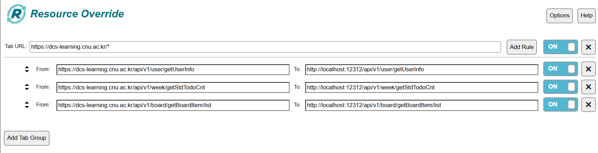
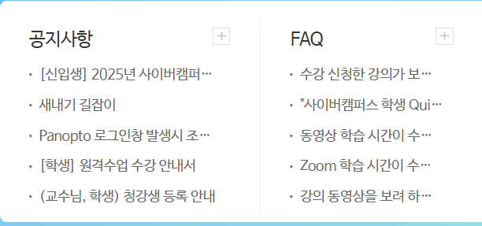
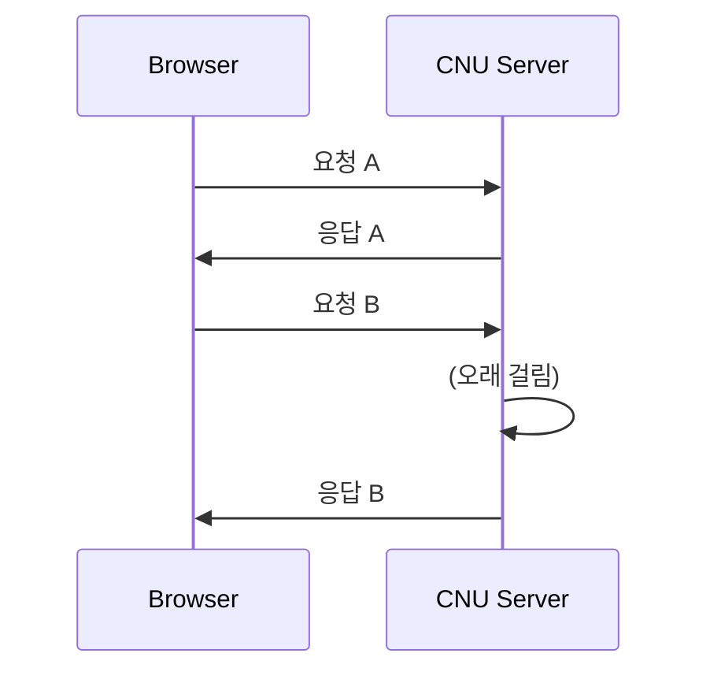
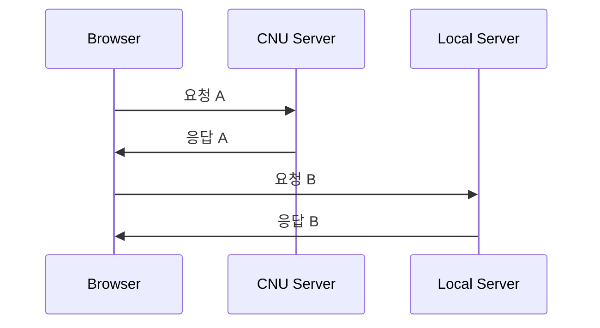

# fake-cnu-server

충남대학교 사이버캠퍼스 이용 시 발생하는 불필요한 일부 요청을 로컬 서버로 우회하여 사용자 경험을 향상시킨다.

<video src="https://github.com/user-attachments/assets/0540ddeb-b877-40b7-8053-3dce53d109c6" width="500px"></video>

## 사용법

준비물: Chrome 계열 브라우저

1. 실행 파일 다운로드: [bin](https://github.com/wirekang/fake-cnu-server/tree/main/bin)에서 다운받거나 직접 빌드

2. [config.json](https://github.com/wirekang/fake-cnu-server/blob/main/config.json) 다운로드

3. `config.json`과 실행 파일을 한 폴더에 두고 실행파일 실행 (CLI에서)

4. [ResourceOverride](https://chromewebstore.google.com/detail/resource-override/pkoacgokdfckfpndoffpifphamojphii) 설치 및 설정

| From                                                          | To                                                    |
|  ------------------------------------------------------------- | ----------------------------------------------------- |
| https://dcs-learning.cnu.ac.kr/api/v1/user/getUserInfo        | http://localhost:12312/api/v1/user/getUserInfo        |
| https://dcs-learning.cnu.ac.kr/api/v1/week/getStdTodoCnt      | http://localhost:12312/api/v1/week/getStdTodoCnt      |
|  https://dcs-learning.cnu.ac.kr/api/v1/board/getBoardItem/list | http://localhost:12312/api/v1/board/getBoardItem/list |

| Endpoint | 설명 | 단축시간(대략) |
| --- | --- | --- |
| /user/getUserInfo | 이름, 학번 등 기본정보 & 쪽지 갯수 | 2초 |
| /week/getStdTodoCnt | To-Do-List 갯수 | 0.4초 |
| /board/getBoardItem/list | 공지사항 목록* | 0.4초 |

> 설정 사진

> 공지사항 목록은 아래를 뜻함

## 다이어그램

## 주의 사항

- 본 프로그램 사용으로 발생하는 모든 문제는 사용자 본인 책임임
- 사물이 거울에 보이는 것보다 가까이 있음
